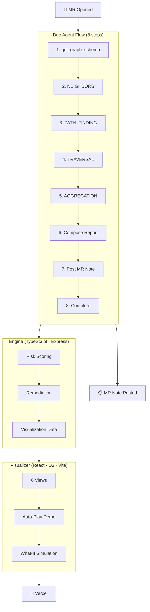

# Orbit Sentinel — Engineering Digital Twin

> GitHub Copilot predicts code. Orbit Sentinel predicts consequences.

[](https://gitlab.com/gitlab-ai-hackathon/transcend/39251857/-/pipelines)
[](https://orbit-sentinel.vercel.app)
[](https://gitlab.com/gitlab-ai-hackathon)
[](LICENSE)

**Orbit Sentinel** is an autonomous engineering digital twin powered by GitLab Orbit. When a developer opens a merge request, it builds a living model of the software system — discovering blast radius, historical incidents, ownership, deployment dependencies, and rollback strategies — then posts a complete impact analysis on the MR.

---

## 🏆 Live Orbit Queries — Proven

The agent ran **real Orbit queries** against project `transcend/39251857` inside GitLab Duo Chat:

| Query | Findings |
|-------|----------|
| `get_graph_schema` | 18 node types, ~45 relationship types discovered |
| Full Graph Traversal | **23 nodes, 43 relationships** across 9 node types |
| Risk Signals | 3 High (bus factor, no coverage, no reviewers), 2 Medium |

[Full traversal results →](orbit-sentinel/docs/orbit-traversal-results.md)

---

## 📋 Judge's Quick Links

| Document | What It Shows |
|----------|---------------|
| [Live Demo](https://orbit-sentinel.vercel.app) | Interactive 6-view dashboard — blast radius, risk, simulation, history, report |
| [Demo Script](orbit-sentinel/demo/demo-script.md) | 3-minute walkthrough — follow along with the live site |
| [Devpost Submission](orbit-sentinel/demo/devpost-submission.md) | Full entry: problem, solution, architecture, quantified impact |
| [Sample MR Note](orbit-sentinel/demo/output/sample-impact-report.md) | What the agent posts on a real merge request |
| [Orbit Traversal Proof](orbit-sentinel/docs/orbit-traversal-results.md) | Raw results from live Orbit queries on the hackathon project |
| [Flow YAML](orbit-sentinel/flow/orbit-sentinel-flow.yaml) | The 8-step Duo Agent Platform workflow |
| [Changelog](orbit-sentinel/CHANGELOG.md) | Full history of features, fixes, polish |
| [Agent Instructions](orbit-sentinel/AGENTS.md) | How the digital twin behaves, error handling, output format |
| [Project Structure](STRUCTURE.md) | Full directory tree with descriptions of every component |

---

## Architecture



Every conclusion cites specific Orbit query evidence. No black box.

---

## Quick Start

```powershell
.\setup.ps1        # One command — install, build, start → http://localhost:5173
```

**Live demo**: [orbit-sentinel.vercel.app](https://orbit-sentinel.vercel.app) — interactive dashboard with 6 views, auto-play, and what-if simulation.

---

## Visualizer Views

| View | What It Shows |
|------|---------------|
| **Overview** | Hero prediction, evidence panel, decision center, counterfactual simulation, digital twin graph |
| **Blast Radius** | Interactive dependency explorer with depth control — click nodes to inspect |
| **Risk** | 5-dimension risk breakdown with probability bars — click mitigations to see risk animate down |
| **Simulation** | Counterfactual analysis with timeline — what if we roll back? add tests? notify owners? |
| **History** | Repository memory with Jaccard similarity scoring — has this failed before? |
| **Report** | Full formatted MR comment output |

---

## Details

**Flow** — 8-step Duo Agent Platform workflow at [`flow/orbit-sentinel-flow.yaml`](orbit-sentinel/flow/orbit-sentinel-flow.yaml) using all 4 Orbit query types (NEIGHBORS, PATH_FINDING, TRAVERSAL, AGGREGATION). Triggered on MR open and new commits. Posts results directly to the MR thread.

**Engine** — Express server at `orbit-sentinel/engine/` deployed on **Render** (TypeScript, 75 tests). Orbit API client, digital twin builder, risk scorer, remediation planner, markdown reporter. Requires `GITLAB_ACCESS_TOKEN` env var for live Orbit queries — without it, falls back to demo mode.

**Duo Integration** — [Skill definition](orbit-sentinel/.gitlab/duo/skill.yml) for Duo Chat, [MCP config](orbit-sentinel/.gitlab/duo/mcp.json) for agent platform, [query recipes](orbit-sentinel/skills/orbit-sentinel/recipes/) with 6 ready-to-use JSON examples.

**Stack** — Node 22, TypeScript 5.5, React 18, D3.js, Vite 5.3, Express, Zod, Vitest.

| Status | |
|--------|-|
| Deployed | Visualizer on [Vercel](https://orbit-sentinel.vercel.app), engine on [Render](https://orbit-sentinel.onrender.com) |
| Tests | 75 passing (engine) + 9 passing (visualizer) |
| ⏳ Live data | Engine needs `GITLAB_ACCESS_TOKEN` env var with read_api scope on an Orbit-enabled group |
| ⏳ AI Catalog | Needs Maintainer token — run `glab skills publish` |
| ⏳ Demo video | Needs recording (≤3 min) — [script](orbit-sentinel/demo/demo-script.md) ready |
| 📖 Docs | [`docs/`](orbit-sentinel/docs/) — traversal proof, deployment guide |

---

## Built For

[GitLab Transcend Hackathon](https://gitlab-transcend.devpost.com/) — Showcase Track · MIT License
