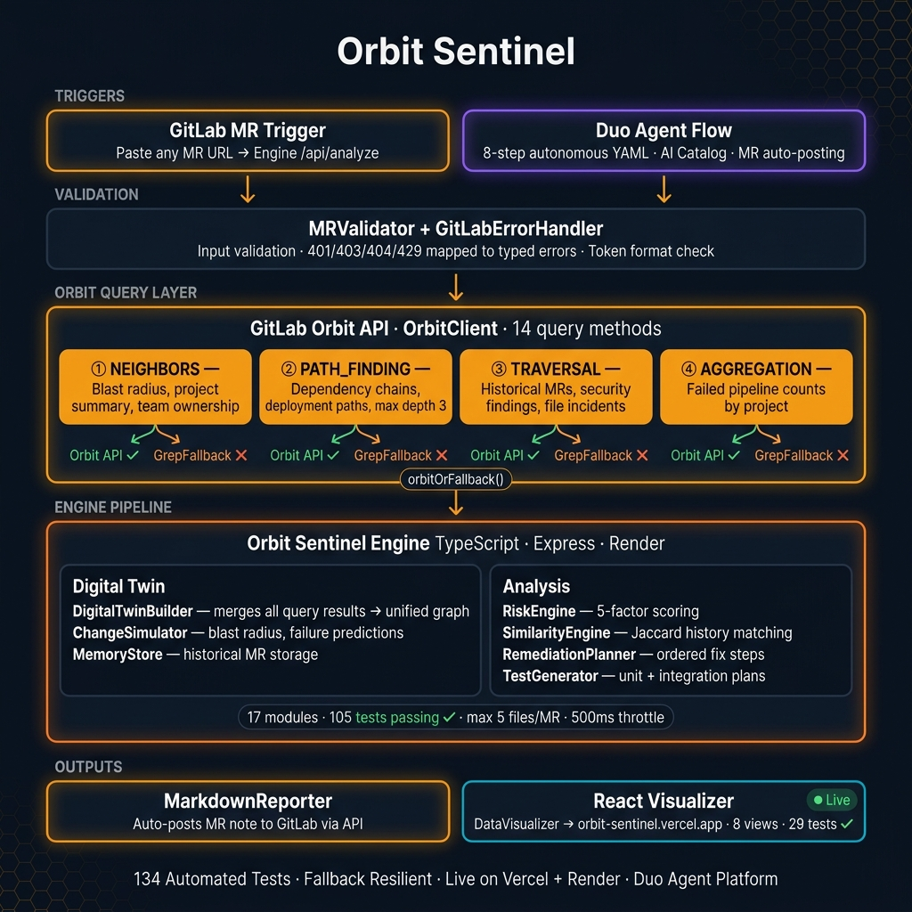

# Orbit Sentinel — Autonomous Engineering Digital Twin

> AI predicts code. Orbit Sentinel predicts **consequences**.

[](https://gitlab.com/gitlab-ai-hackathon/transcend/39251857/-/pipelines)
[](https://orbit-sentinel.vercel.app)
[](https://gitlab-transcend.devpost.com)
[](https://orbit-sentinel.vercel.app/?judge=true)

**Orbit Sentinel** is an autonomous engineering digital twin powered by GitLab Orbit. Paste any GitLab MR URL to build a living model of the affected system — discovering blast radius, historical incidents, ownership, deployment dependencies, and rollback strategies across **8 interactive dashboard views**.



---

## Judge's Quick Links

| Document | What It Shows |
|----------|---------------|
| [Live Demo](https://orbit-sentinel.vercel.app) | Interactive 8-view dashboard — loads instantly, upgrades to live data when engine responds |
| [Judge's Tour](https://orbit-sentinel.vercel.app/?judge=true) | Guided walkthrough — Space for auto-demo, ← → to navigate |
| [Devpost Submission](orbit-sentinel/demo/devpost-submission.md) | Full entry: inspiration, architecture, quantified impact |
| [Demo Script](orbit-sentinel/demo/demo-script.md) | 3-minute walkthrough to follow with the live site |
| [Sample MR Note](orbit-sentinel/demo/output/sample-impact-report.md) | What the agent posts on a merge request |
| [Orbit Traversal Proof](orbit-sentinel/docs/orbit-traversal-results.md) | Raw results from live Orbit queries |
| [Flow YAML](orbit-sentinel/flow/orbit-sentinel-flow.yaml) | 8-step Duo Agent Platform workflow (published to AI Catalog) |
| [Changelog](orbit-sentinel/CHANGELOG.md) | Full feature and fix history |

---

## What Makes This Different

| Differentiator | Orbit Sentinel | Traditional CI/CD |
|----------------|---------------|------------------|
| **Visual analysis** | 40 components, 8 views, interactive D3 graphs | Text-only output |
| **Closed-loop accuracy** | Tracks predictions post-merge with 7-day survival window, computes accuracy score | Predicts but never verifies |
| **4 Orbit query types** | NEIGHBORS + PATH_FINDING + TRAVERSAL + AGGREGATION cross-referenced | Single-query or no graph data |
| **Fallback resilience** | `orbitOrFallback()` on every query — grep-based file analysis when Orbit is down | Fails on Orbit downtime |
| **Test coverage** | **134 tests** (105 engine + 29 visualizer) — zero `as any` in production code | Minimal or no test suite |
| **Deployment** | Vercel + Render, Docker Compose, CI/CD (6 jobs, 4 stages) | Manual setup |
| **Onboarding** | Judge's Tour, auto-demo, setup wizard, keyboard shortcuts | No UX |

---

## MR Analysis — Core Capability

### Paste Any GitLab MR URL

The **MR Analyzer** panel accepts any GitLab merge request URL — parses the project path and MR ID, fetches changed files via the engine's CORS proxy, then runs all 4 Orbit query types against the affected files.

**Live analysis flow:**
1. Paste MR URL → auto-extracts project + MR IID
2. Engine fetches changed files from GitLab API (up to 5 files, CORS-free)
3. `DigitalTwinBuilder` executes NEIGHBORS + PATH_FINDING + TRAVERSAL + AGGREGATION
4. Results merged into unified graph → 8 dashboard views populate
5. Post-merge: every prediction tracked against real outcome in Predictions Tracker

**No token required** for basic analysis. Optional GitLab PAT (`glpat-xxx`, `read_api` scope) enables richer file content — sent once, discarded after.

### 3 Pre-Configured Quick Demos

| Scenario | What It Shows | Risk |
|----------|---------------|------|
| 🔴 **Critical Risk** | Pipeline failed, 7 downstream services at risk, no rollback plan | 88% |
| 🟡 **Medium Risk** | Empty diff, no pipeline, abandoned branch pattern | 55% |
| 🟢 **Low Risk** | All tests pass, reviewers approved, no downstream impact | 15% |

Each populates all 8 views with realistic interconnected data.

---

## The Closed Loop: Predict → Verify → Improve

Orbit Sentinel doesn't just predict — it **proves its predictions were right**.

| View | What It Shows |
|------|---------------|
| **Predictions Tracker** 🎯 | Scoreboard of all past predictions vs actual outcomes. Animated stat counters, risk trend chart (DualSparkline), accuracy rate, true/false positives |
| **Post-merge verification** | Enter "failed" or "shipped" for any tracked MR. Accuracy score updates in real-time. 7-day survival window for high-risk predictions |
| **Filterable ledger** | Sort by date, risk level, or outcome. Filter by pending / verified / failed |

---

## Architecture

### Engine — TypeScript · Express · Render (105 tests)

- **`MRValidator + GitLabErrorHandler`** — validates all inputs before any query runs; maps `401/403/404/429/5xx` to typed `GitLabErrorCode` instances with concrete `recoveryAction` prompts
- **`DigitalTwinBuilder`** — orchestrates 9 Orbit queries across all 4 query types via `orbitOrFallback()` wrappers, merges results into a unified graph (23+ nodes, 43+ edges)
- **`orbitOrFallback()`** — wraps every query: tries Orbit API first, falls back to `GrepFallback` on auth/network error; empty Orbit results also trigger enrichment from grep without marking the session as degraded
- **`GrepFallback`** — fetches changed files via GitLab Repository Files API, parses `import`/`require` statements, builds dependency graph without Orbit
- **`ChangeSimulator`** — computes blast radius and failure predictions from the digital twin graph
- **`RiskEngine`** — 5-factor scoring from Orbit evidence (predictions, blast radius, incidents, pipeline health, reviewer coverage)
- **`MemoryStore + SimilarityEngine`** — Jaccard similarity engine for historical incident matching; stores all past MR data for cross-session recall
- **`RemediationPlanner`** — prioritizes and orders concrete fix steps from failure predictions
- **`TestGenerator`** — generates unit + integration test plans from blast radius analysis
- **`MarkdownReporter`** — formats the full report and auto-posts it to the MR via GitLab API
- **`DataVisualizer`** — transforms the SentinelReport into dashboard JSON consumed by the React frontend
- Rate-limited: max 5 files per MR, 500ms throttle between iterations · Debug endpoint: `/api/debug-orbit`

### Visualizer — React · D3 · Vite · Vercel (29 tests)

- 40 components, zero CSS files — design token system (colors, z-index tiers, animation presets, spacing scale on 4px grid)
- 3 responsive breakpoints (360px–768px+), touch-friendly
- **Judge's Tour** (`?judge=true`) — guided walkthrough, Space for auto-demo, ← → / 1-8 to navigate
- **Keyboard shortcuts**: **1–8** switch views, **D** toggle theme, **E** export report as HTML
- **DataModeBanner**: 6 modes — loading / connecting / live / demo / error / degraded
- **OrbitQueryInspector**: expandable raw GraphQL results from all 4 query types with per-query timing

### Duo Agent Platform Integration

- **Flow YAML** (`flow/orbit-sentinel-flow.yaml`) — 8 steps, published to AI Catalog with successful run
- **Skill definition** (`.gitlab/duo/skill.yml`) — category: `code_review`, 3 capabilities
- **MCP config** (`.gitlab/duo/mcp.json`) — HTTP connection to Orbit knowledge graph
- **6 query recipes** (`skills/orbit-sentinel/recipes/`) — ready-to-use JSON for all 4 Orbit query types

### Component Design Patterns

- **Atomic Design**: 40 components — atoms → molecules → organisms → templates → pages
- **State Management**: Custom hooks (`useAnimatedValue`, `useMediaQuery`, `useVulnerabilities`) + React Context API
- **Data Flow**: `ApiService` → `DigitalTwinBuilder` → `DataVisualizer` → dashboard JSON

### Security

- **Strict Headers** on all requests/responses: `X-Content-Type-Options`, `X-Frame-Options: DENY`, `Strict-Transport-Security`, `Referrer-Policy`
- **Token Validation**: middleware verifies `glpat-` prefix before any API call
- **Validation Layers**: strict input schemas, non-negative numerical identifiers, non-empty descriptors

### Performance

- **Bundle**: ~125KB gzipped, lazy-loaded chunks via Vite code splitting
- **Rendering**: React 18 concurrent rendering, `Suspense` boundaries, `React.memo` / `useMemo`
- **Caching**: 5-minute API response cache, `localStorage` for preferences and theme

---

## Fallback Resilience

When Orbit's API is unavailable, Orbit Sentinel **degrades gracefully**:

1. Each of 9 Orbit query calls is wrapped in `orbitOrFallback()` — `try` Orbit first, `catch` on network/auth errors
2. On failure, falls back to **grep-based file analysis** via GitLab Repository Files API
3. Changed files are fetched, dependencies parsed (`import`/`require` in JS/TS, `import`/`from` in Python)
4. Analysis completes with `fallback: true` flagged in the response
5. Visualizer shows a **"Degraded" mode** banner — orange dot, orange border
6. Empty Orbit results (normal for new projects) no longer trigger fallback — the app stays "Live"

**Fast path:** No GitLab token → returns empty immediately instead of hanging on timeouts.

---

## Quick Start

```powershell
.\orbit-sentinel\setup.ps1        # One command — install, build, start → http://localhost:5173
```

**Live demo**: [orbit-sentinel.vercel.app](https://orbit-sentinel.vercel.app) — interactive dashboard, auto-play, post-merge verification.

**Docker**:
```bash
docker compose up   # Engine (3001) + visualizer (80 via nginx) with health checks
```

---

## Dashboard Views

| View | What It Shows | Orbit Query |
|------|---------------|-------------|
| **Overview** | Impact Calculator (interactive ROI sliders), hero prediction, evidence panel, decision center, counterfactual simulation, digital twin graph, Orbit Query Inspector | All 4 |
| **Setup** | 4-step guided journey — Mission → Architecture → Setup → Launch | — |
| **Blast Radius** | Interactive dependency explorer with depth control — click nodes to inspect. Security Findings stat pill with critical/high vulnerability counts | NEIGHBORS |
| **Risk** | 5-dimension risk breakdown with probability bars — click mitigations to see risk animate down. Pipeline Failure Correlation card, failure probability heatmap | AGGREGATION |
| **Forecast** | Counterfactual analysis with timeline — toggle variables, watch risk animate in real-time | Simulation |
| **History** | Repository memory with Jaccard similarity scoring — has this failed before? | TRAVERSAL |
| **Report** | Full formatted MR comment output — ready to copy. Export as Markdown or JSON | All 4 |
| **Predictions Tracker** 🎯 | Accuracy scoreboard, post-merge verification, risk trend chart, vulnerability-adjusted predictions | Closed-loop |

---

## Status

| | |
|--|--|
| **Deployed** | Visualizer on [Vercel](https://orbit-sentinel.vercel.app), engine on [Render](https://orbit-sentinel.onrender.com) |
| **Tests** | **134 passing** (105 engine · 29 visualizer) |
| **Live Orbit Data** | Real graph data for project ID **39251857** (222+ nodes, 187+ edges) |
| **Quick Demos** | 3 pre-configured risk scenarios (Critical 🔴, Medium 🟡, Low 🟢) |
| **Fallback** | Grep-based file analysis when Orbit unreachable — degraded mode banner in UI |
| **Closed Loop** | Predictions tracked post-merge with accuracy scoring and 7-day survival window |
| **Docker** | `docker compose up` boots full stack with health checks |
| **Flow Published** | 8-step Duo Agent Platform workflow in AI Catalog (1+ successful run) |
| **Stack** | Node 22+, TypeScript 5.5, React 18, D3.js, Vite 5.3, Express, Vitest |

---

## UX Highlights

| Feature | Details |
|---------|---------|
| **Instant load** | Demo data shown immediately — engine data swapped in background when ready |
| **Pulsing live badge** | Green dot with `pulseDot` animation + "Engine Live" label when engine is reachable |
| **Degraded mode banner** | Orange dot + border when Orbit is down and fallback is active |
| **Success toast** | Green banner "✓ Analysis complete — MR !X" fades in for 5s |
| **MR validation** | Input shows format indicator when URL matches `gitlab.com/<project>/-/merge_requests/<digits>` |
| **Glassmorphism** | `backdrop-filter: blur(6px)` on cards, architecture nodes, flow progress |
| **Keyboard shortcuts** | **1–8** switch views, **D** toggle demo, **E** toggle editor — tooltip overlay at screen bottom |
| **Theme toggle** | 🌙/☀️ in top nav — persists in localStorage, all components adapt via CSS variables |
| **Mobile** | 3 breakpoints to 360px, touch scrolling, dropdown nav on small screens |

---

## Built For

[GitLab Transcend Hackathon](https://gitlab-transcend.devpost.com/) — Showcase Track · MIT License
