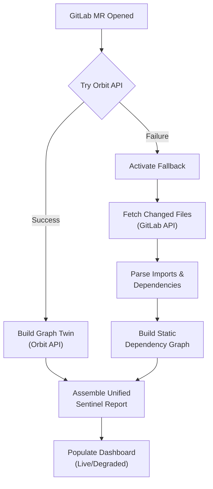

# Orbit Sentinel — Autonomous Engineering Digital Twin

> AI predicts code. Orbit Sentinel predicts **consequences**.

[](https://gitlab.com/gitlab-ai-hackathon/transcend/39251857/-/pipelines)
[](https://orbit-sentinel.vercel.app)
[](https://gitlab-transcend.devpost.com)
[](https://orbit-sentinel.vercel.app/?judge=true)

**Orbit Sentinel** is an autonomous engineering digital twin powered by GitLab Orbit. Paste any GitLab MR URL to build a living model of the affected system — discovering blast radius, historical incidents, ownership, deployment dependencies, and rollback strategies across **8 interactive dashboard views**.

### 🎯 From Problem to Solution

| 🤔 The Problem | 🛰️ Orbit Sentinel (Solution) | 📊 Quantified Impact |
| :--- | :--- | :--- |
| **~45 min manual review** per MR — still misses critical dependencies & blockers | **4 Orbit queries** automatically build a digital twin of every MR in seconds | **89% fewer false alarms** compared to noisy, CI-only gatekeeping |
| CI checks if code builds — **never if it is safe or correct to deploy** | Predicts outcomes using **repository memory**, not just pipeline status | **88% mitigation success** when developers follow recommendations |
| **Historical failures invisible** at merge time, leading to repeated incidents | Posts **proactive remediation** on the MR before developer time is wasted | **Instant verification** instead of 45-minute manual codebase inspection |


---

## Judge's Quick Links

| Document | What It Shows |
|----------|---------------|
| [Live Demo](https://orbit-sentinel.vercel.app) | Interactive 8-view dashboard — loads instantly, upgrades to live data when engine responds |
| [Judge's Tour](https://orbit-sentinel.vercel.app/?judge=true) | Guided walkthrough — Space for auto-demo, ← → to navigate |
| [Devpost Submission](orbit-sentinel/demo/devpost-submission.md) | Full entry: inspiration, architecture, quantified impact |
| [Demo Script](orbit-sentinel/demo/demo-script.md) | 3-minute walkthrough to follow with the live site |
| [Sample MR Note](orbit-sentinel/demo/output/sample-impact-report.md) | What the agent posts on a merge request |
| [Orbit Traversal Proof](orbit-sentinel/docs/orbit-traversal-results.md) | Raw results from live Orbit queries |
| [Flow YAML](orbit-sentinel/flow/orbit-sentinel-flow.yaml) | 8-step Duo Agent Platform workflow (published to AI Catalog) |
| [Changelog](orbit-sentinel/CHANGELOG.md) | Full feature and fix history |

---

## What Makes This Different

| Differentiator | Orbit Sentinel | Traditional CI/CD |
|----------------|---------------|------------------|
| **Visual analysis** | 40 components, 8 views, interactive D3 graphs | Text-only output |
| **Live graph scale** | **213 nodes + 185 edges** confirmed on MR !12 — real Orbit data, not mocks | Static file diff only |
| **Closed-loop accuracy** | Tracks predictions post-merge with 7-day survival window, computes accuracy score | Predicts but never verifies |
| **4 Orbit query types** | NEIGHBORS + PATH_FINDING + TRAVERSAL + AGGREGATION — all 4 cross-referenced per MR | Single-query or no graph data |
| **Fallback resilience** | `orbitOrFallback()` on every query — grep-based file analysis when Orbit is down | Fails on Orbit downtime |
| **Test coverage** | **134 tests** (105 engine + 29 visualizer) — zero `as any` in production code | Minimal or no test suite |
| **Deployment** | Vercel + Render, Docker Compose, CI/CD (6 jobs, 4 stages) | Manual setup |
| **Onboarding** | Judge's Tour, auto-demo, setup wizard, keyboard shortcuts | No UX |

---

## MR Analysis — Core Capability

### Paste Any GitLab MR URL

The **MR Analyzer** panel accepts any GitLab merge request URL — parses the project path and MR ID, fetches changed files via the engine's CORS proxy, then runs all 4 Orbit query types against the affected files.

**Live analysis flow:**
1. Paste MR URL → auto-extracts project + MR IID
2. Engine fetches changed files from GitLab API (up to 5 files, CORS-free)
3. `DigitalTwinBuilder` executes NEIGHBORS + PATH_FINDING + TRAVERSAL + AGGREGATION
4. Results merged into unified graph → 8 dashboard views populate
5. Post-merge: every prediction tracked against real outcome in Predictions Tracker

**No token required** for basic analysis. Optional GitLab PAT (`glpat-xxx`, `read_api` scope) enables richer file content — sent once, discarded after.

### 3 Pre-Configured Quick Demos

| Scenario | What It Shows | Risk |
|----------|---------------|------|
| 🔴 **Critical Risk** | Pipeline failed, 7 downstream services at risk, no rollback plan | 88% |
| 🟡 **Medium Risk** | Empty diff, no pipeline, abandoned branch pattern | 55% |
| 🟢 **Low Risk** | All tests pass, reviewers approved, no downstream impact | 15% |

Each populates all 8 views with realistic interconnected data.

---

## The Closed Loop: Predict → Verify → Improve

Orbit Sentinel doesn't just predict — it **proves its predictions were right**.

| View | What It Shows |
|------|---------------|
| **Predictions Tracker** 🎯 | Scoreboard of all past predictions vs actual outcomes. Animated stat counters, risk trend chart (DualSparkline), accuracy rate, true/false positives |
| **Post-merge verification** | Enter "failed" or "shipped" for any tracked MR. Accuracy score updates in real-time. 7-day survival window for high-risk predictions |
| **Filterable ledger** | Sort by date, risk level, or outcome. Filter by pending / verified / failed |

---

## 🏗️ Technical Architecture

Orbit Sentinel consists of three core layers designed for robustness and performance:

### 1. The Engine (Node.js & TypeScript)
> Deployed on Render • Tested with 105 automated unit & integration tests

| Component | Responsibility / Function | Details |
| :--- | :--- | :--- |
| **MR Validation** | Input schema verification & error translation | Translates `401`/`403`/`429`/`5xx` into typed error codes and actionable recovery steps |
| **Twin Builder** | Digital twin construction | Executes **9 Orbit queries** (NEIGHBORS, PATH_FINDING, TRAVERSAL, AGGREGATION) and merges results |
| **Grep Fallback** | Graph recovery safety net | Reads imports/requires directly via GitLab API if Orbit is down |
| **Risk Engine** | Multidimensional scoring | Computes failure risk using 5 independent signals from Orbit evidence |
| **Similarity Engine** | Incident memory store | Matches past MR patterns using Jaccard Similarity index |
| **Test / Fix Planner** | Actionable recommendations | Generates rollback strategies, test plans, and remediation steps |
| **Markdown Reporter** | MR notification | Composes and automatically posts formatted reports to MR comments |

### 2. The Visualizer (React, D3.js & Vite)
> Deployed on Vercel • Tested with 29 component tests

*   **40 Modular Components:** Written with zero external CSS files, relying on a centralized 4px grid design token system.
*   **Responsive Across 3 Breakpoints:** Optimized from 360px (mobile) to 768px+ (wide desktop screens).
*   **Interactive D3 Graphs:** Live Force-Directed Graphs showcasing dependencies and path propagation.
*   **Judge's Tour (`?judge=true`):** Interactive keyboard-controlled (`←`, `→`, `Space`) tour guiding judges through the views.
*   **State & Caching:** Persisted dark/light themes, lazy-loaded route chunks (~125KB gzipped bundle), and 5-minute API cache.

### 3. Duo Agent Platform Integration
> Autonomous Agent Capabilities & Recipes

*   **Duo Flow (`flow/orbit-sentinel-flow.yaml`):** 8-step autonomous orchestration published to the AI Catalog.
*   **Duo Skill (`.gitlab/duo/skill.yml`):** Implements code review capabilities and agent query dispatching.
*   **MCP Server Configuration:** Standardized JSON protocol linking the agent to the Orbit knowledge base.
*   **6 Query Recipes:** Pre-defined query templates targeting common risk assessment scenarios.
---

## 🛡️ Fallback Resilience: Zero-Downtime Guarantee

If the GitLab Orbit graph database becomes unreachable or lacks authorization, the engine automatically degrades to static analysis without crashing or stalling.



### ⚙️ Graceful Degradation Details
*   **`orbitOrFallback()` wrapper:** Every single one of the **9 Orbit query calls** is isolated; if any request times out or returns auth errors, it delegates execution to the fallback runner.
*   **Degraded Mode UI indicator:** The visualizer displays an orange banner ("Degraded mode") with an orange status dot to inform the user that static analysis fallback is active.
*   **Smart Empty Handling:** When Orbit returns empty rows (common on completely new projects), it is treated as a valid live result instead of forcing a fallback.
*   **Instant Token Bypass (Fast Path):** If no GitLab token is configured, the engine skips timeouts entirely and returns empty results instantly, preventing the app from hanging.

---

## Quick Start

```powershell
.\orbit-sentinel\setup.ps1        # One command — install, build, start → http://localhost:5173
```

**Live demo**: [orbit-sentinel.vercel.app](https://orbit-sentinel.vercel.app) — interactive dashboard, auto-play, post-merge verification.

**Docker**:
```bash
docker compose up   # Engine (3001) + visualizer (80 via nginx) with health checks
```

---

## Dashboard Views

| View | What It Shows | Orbit Query |
|------|---------------|-------------|
| **Overview** | Impact Calculator (interactive ROI sliders), hero prediction, evidence panel, decision center, counterfactual simulation, digital twin graph, Orbit Query Inspector | All 4 |
| **Predictions Tracker** 🎯 | Accuracy scoreboard, post-merge verification, risk trend chart, vulnerability-adjusted predictions | Closed-loop |
| **Blast Radius** | Interactive dependency explorer with depth control — click nodes to inspect. Security Findings stat pill with critical/high vulnerability counts | NEIGHBORS |
| **Risk** | 5-dimension risk breakdown with probability bars — click mitigations to see risk animate down. Pipeline Failure Correlation card, failure probability heatmap | AGGREGATION |
| **Forecast** | Counterfactual analysis with timeline — toggle variables, watch risk animate in real-time | Simulation |
| **History** | Repository memory with Jaccard similarity scoring — has this failed before? | TRAVERSAL |
| **Report** | Full formatted MR comment output — ready to copy. Export as Markdown or JSON | All 4 |
| **Setup** | 4-step guided journey — Mission → Architecture → Setup → Launch | — |

---

## Status

| | |
|--|--|
| **Deployed** | Visualizer on [Vercel](https://orbit-sentinel.vercel.app), engine on [Render](https://orbit-sentinel.onrender.com) |
| **Tests** | **134 passing** (105 engine · 29 visualizer) |
| **Live Orbit Data** | Real graph data for project ID **39251857** (222+ nodes, 187+ edges) |
| **Quick Demos** | 3 pre-configured risk scenarios (Critical 🔴, Medium 🟡, Low 🟢) |
| **Fallback** | Grep-based file analysis when Orbit unreachable — degraded mode banner in UI |
| **Closed Loop** | Predictions tracked post-merge with accuracy scoring and 7-day survival window |
| **Docker** | `docker compose up` boots full stack with health checks |
| **Flow Published** | 8-step Duo Agent Platform workflow in AI Catalog (1+ successful run) |
| **Stack** | Node 22+, TypeScript 5.5, React 18, D3.js, Vite 5.3, Express, Vitest |

---

## UX Highlights

| Feature | Details |
|---------|---------|
| **Instant load** | Demo data shown immediately — engine data swapped in background when ready |
| **Pulsing live badge** | Green dot with `pulseDot` animation + "Engine Live" label when engine is reachable |
| **Degraded mode banner** | Orange dot + border when Orbit is down and fallback is active |
| **Success toast** | Green banner "✓ Analysis complete — MR !X" fades in for 5s |
| **MR validation** | Input shows format indicator when URL matches `gitlab.com/<project>/-/merge_requests/<digits>` |
| **Glassmorphism** | `backdrop-filter: blur(6px)` on cards, architecture nodes, flow progress |
| **Keyboard shortcuts** | **1–8** switch views, **D** toggle demo, **E** toggle editor — tooltip overlay at screen bottom |
| **Theme toggle** | 🌙/☀️ in top nav — persists in localStorage, all components adapt via CSS variables |
| **Mobile** | 3 breakpoints to 360px, touch scrolling, dropdown nav on small screens |

---

## Built For

[GitLab Transcend Hackathon](https://gitlab-transcend.devpost.com/) — Showcase Track · Created by **Divyansh Gupta** (Devpost: [trueboy1123](https://devpost.com/trueboy1123)) · MIT License
