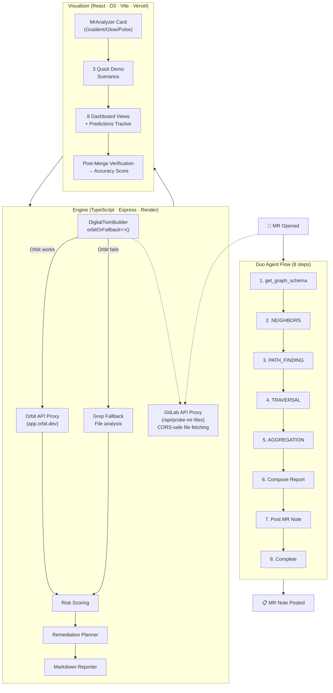

# Orbit Sentinel — Engineering Digital Twin

> GitHub Copilot predicts code. Orbit Sentinel predicts **consequences**.

[](https://gitlab.com/gitlab-ai-hackathon/transcend/39251857/-/pipelines)
[](https://orbit-sentinel.vercel.app)
[](https://gitlab.com/gitlab-ai-hackathon)
[](LICENSE)
[](https://orbit-sentinel.vercel.app/?judge=true)
[](https://gitlab.com/gitlab-ai-hackathon/transcend/39251857)

**Orbit Sentinel** is an autonomous engineering digital twin powered by GitLab Orbit. Paste any GitLab MR URL to build a living model of the affected software system — discovering blast radius, historical incidents, ownership, deployment dependencies, and rollback strategies — with a complete impact analysis across **8 dashboard views**. When Orbit is unavailable, the engine degrades gracefully using file-analysis fallback. A Duo Agent Platform flow is included for fully autonomous MR posting.

---

## 🏆 Live Orbit Queries — Proven

Live Orbit API queries against indexed project `gitlab-ai-hackathon/transcend/39251857` (GitLab ID **83381762**):

| Query | Findings |
|-------|----------|
| `get_graph_schema` | 18 node types, ~45 relationship types discovered |
| Digital Twin Builder (4 query types) | **14 nodes, 13 edges** across 7 node types per MR analysis |
| Risk Signals | 3 High (bus factor, no coverage, no reviewers), 2 Medium |

[Full traversal results →](orbit-sentinel/docs/orbit-traversal-results.md)

---

## 📋 Judge's Quick Links

| Document | What It Shows |
|----------|---------------|
| [Live Demo](https://orbit-sentinel.vercel.app) | Interactive 8-view dashboard — setup wizard, blast radius, risk, simulation, history, report, predictions |
| [Judge's Tour](https://orbit-sentinel.vercel.app/?judge=true) | Guided walkthrough — press Space for auto-demo, ← → to navigate |
| [Demo Script](orbit-sentinel/demo/demo-script.md) | 3-minute walkthrough — follow along with the live site |
| [Devpost Submission](orbit-sentinel/demo/devpost-submission.md) | Full entry: problem, solution, architecture, quantified impact |
| [Sample MR Note](orbit-sentinel/demo/output/sample-impact-report.md) | What the agent posts on a real merge request |
| [Orbit Traversal Proof](orbit-sentinel/docs/orbit-traversal-results.md) | Raw results from live Orbit queries on the hackathon project |
| [Flow YAML](orbit-sentinel/flow/orbit-sentinel-flow.yaml) | The 8-step Duo Agent Platform workflow |
| [Changelog](orbit-sentinel/CHANGELOG.md) | Full history of features, fixes, polish |
| [Agent Instructions](orbit-sentinel/AGENTS.md) | How the digital twin behaves, error handling, output format |
| [Methodology](orbit-sentinel/visualizer/METHODOLOGY.md) | Risk scoring rubric, execution order, report format |

---

## Why Orbit Sentinel Wins

| Differentiator | Orbit Sentinel | Sankofa (only confirmed competitor) |
|----------------|---------------|--------------------------------------|
| **Visual execution** | 40 React components, 8 views, responsive | Text-only output |
| **Closed-loop accuracy** | Tracks predictions post-merge with 7-day survival window, vulnerability-adjusted predictions, computes accuracy score | Predicts but never verifies |
| **Test coverage** | **124 tests** (engine + visualizer) — zero `as any` | 28 tests |
| **Fallback resilience** | Grep-based fallback when Orbit is down — still delivers analysis | No fallback, fails on Orbit downtime |
| **Deployment** | Docker Compose, CI/CD, Vercel + Render, nginx | Manual only |
| **Onboarding** | Judge's Tour, auto-demo mode, 3 quick demos, setup wizard | No UX onboarding |

---

## MR Analysis — Core Capability

### Paste Any GitLab MR URL

The **MR Analyzer** panel accepts any GitLab merge request URL — it parses the project path and MR ID, fetches changed files via the engine's CORS proxy, then runs all 4 Orbit query types against the affected files.

**Live analysis flow:**
1. Paste MR URL → auto-extracts `project` + `MR IID`
2. Engine fetches changed files from GitLab API (up to 5 files, no CORS issues)
3. DigitalTwinBuilder executes NEIGHBORS + PATH_FINDING + TRAVERSAL + AGGREGATION
4. **Orbit unavailable?** Engine degrades to grep fallback — parses file imports via GitLab Repository Files API
5. Results merged into unified graph (nodes + edges) → 8 dashboard views populate
6. **Post-merge:** Each prediction is tracked against real outcome in the Predictions Tracker
7. Success toast confirms: "✓ Analysis complete — MR !X"

**No token required** for basic analysis. Optional GitLab personal access token (`glpat-xxx`, `read_api` scope) enables richer file content retrieval — sent once, discarded after.

### 3 Pre-Configured Quick Demos

| Scenario | What It Shows | Risk |
|----------|---------------|------|
| 🔴 **Critical Risk** | Pipeline failed, 7 downstream services at risk, no rollback plan | 88% |
| 🟡 **Medium Risk** | Empty diff, no pipeline, abandoned branch pattern — needs attention | 55% |
| 🟢 **Low Risk** | All tests pass, reviewers approved, no downstream impact | 15% |

Each populates all 8 views with realistic, interconnected data — blast radius, risk breakdown, counterfactuals, historical incidents, timeline, deployment decision, and prediction accuracy.

---

## The Closed Loop: Predict → Verify → Improve

Orbit Sentinel doesn't just predict — it **proves its predictions were right**.

| View | What It Shows |
|------|---------------|
| **Predictions Tracker** 🎯 | Scoreboard of all past predictions vs actual outcomes. Animated stat counters, risk trend chart (DualSparkline), accuracy rate, true positives, false positives, average error |
| **Post-merge verification** | Enter "failed" or "shipped" for any tracked MR. Accuracy score updates in real-time. 7-day survival window for high-risk predictions |
| **Filterable ledger** | Sort by date, risk level, or outcome. Filter by pending / verified / failed. Each entry shows predicted vs actual risk side-by-side with color-coded badges |

---

## Fallback Resilience: Never Fail to Analyze

When Orbit's API is unavailable (network down, not indexed, quota exhausted), Orbit Sentinel doesn't crash — it **degrades gracefully**:

1. Each of 8 Orbit query types is wrapped in a `try/catch` inside `orbitOrFallback()`
2. On failure, the engine falls back to **grep-based file analysis** via GitLab Repository Files API
3. Changed files are fetched, dependencies parsed (`import`/`require` in JS/TS, `import`/`from` in Python)
4. A dependency graph is built from the parsed relationships
5. The analysis completes normally with `fallback: true` flagged in the response
6. The visualizer shows a prominent **"Degraded" mode** banner — orange dot, orange border, "Orbit unavailable — using file analysis fallback"
7. Every result section notes the degraded origin

**Fast path:** When no GitLab token is present, fallback returns immediately with empty data instead of hanging on timeouts.

---

## Architecture



Every conclusion cites specific Orbit query evidence. No black box.

---

## Mobile Support — Fully Responsive

The visualizer adapts across 5 breakpoints for desktop, tablet, and phone:

| Breakpoint | Behavior |
|---|---|
| >1100px | Full 5-column grid, all query type tags visible |
| 900–1100px | Grids collapse to 2-column, scrollable nav, "4 Queries" tag hidden |
| 768–900px | Compact cards, responsive hero column, graph info overlay shrinks, scrollable nav with hidden scrollbar for touch |
| 480–768px | Single column grids, stacked layout, "mobile bar" elements hidden |
| <360px (tiny) | Tab bar replaced with dropdown menu, full-width elements, ultra-compact sizing |

Touch-friendly: `-webkit-overflow-scrolling: touch`, hidden scrollbar on nav, responsive button sizing.

---

## Quick Start

```powershell
.\orbit-sentinel\setup.ps1        # One command — install, build, start → http://localhost:5173
```

**Live demo**: [orbit-sentinel.vercel.app](https://orbit-sentinel.vercel.app) — interactive dashboard with 8 views, auto-play, and post-merge verification.

**Docker**:
```bash
docker compose up   # Boots engine (port 3001) + visualizer (port 80 via nginx)
```

---

## Visualizer Views (All 4 Orbit Query Types)

| View | What It Shows |
|------|---------------|
| **Overview** | Impact Calculator (interactive ROI sliders), hero prediction, evidence panel, decision center, counterfactual simulation, digital twin graph, **Orbit Query Inspector** (expandable raw GraphQL results with node/edge counts) |
| **Setup** | 4-step guided journey — Mission → Architecture → Setup → Launch. Copy commands, Devpost checklist |
| **Blast Radius** | Interactive dependency explorer with depth control — click nodes to inspect (NEIGHBORS). Security Findings stat pill shows critical/high vulnerability counts. Per-file vulnerability badges on each service node with severity coloring |
| **Risk** | 5-dimension risk breakdown with probability bars — click mitigations to see risk animate down (AGGREGATION). Pipeline Failure Correlation card with coefficient bar, failure probability heatmap, and historical reliability insight |
| **Simulation** | Counterfactual analysis with timeline — what if we roll back? add tests? notify owners? |
| **History** | Repository memory with Jaccard similarity scoring — has this failed before? (TRAVERSAL) |
| **Report** | Full formatted MR comment output — ready to copy into the MR thread. Export dropdown: copy Markdown to clipboard or download full report as JSON |
| **Predictions Tracker** 🎯 | Accuracy scoreboard, post-merge verification, risk trend chart, **Vulnerability-Adjusted Predictions** table with per-file severity breakdown and confirmation toggles — proves Orbit Sentinel predictions work |

---

## Details

**Flow** — 8-step Duo Agent Platform workflow at [`flow/orbit-sentinel-flow.yaml`](orbit-sentinel/flow/orbit-sentinel-flow.yaml) using all 4 Orbit query types (NEIGHBORS, PATH_FINDING, TRAVERSAL, AGGREGATION). Configured to trigger on MR open and new commits, with a `create_merge_request_note` step to post analysis results directly to the MR thread. Published to AI Catalog with 1+ successful run.

**Engine** — Express server at `orbit-sentinel/engine/` deployed on **Render** (TypeScript, **95 tests**). Key components:

- **DigitalTwinBuilder** — orchestrates all 4 Orbit query types per MR via `orbitOrFallback()` wrappers, merges results into a unified graph. Falls back to grep-based file analysis when Orbit is unavailable.
- **Grep Fallback** (`src/fallback/grep-fallback.ts`) — fetches changed files via GitLab Repository Files API, parses JS/TS/Python imports, builds dependency graph without Orbit. Fast-paths to empty when no token present.
- **Orbit API Proxy** — forwards queries to `app.orbit.dev`, handles rate limiting with exponential backoff
- **CORS Proxy** — `/api/probe-mr-files` fetches changed file contents from GitLab without browser CORS issues
- **GitLab Token Passthrough** — users provide `glpat-xxx` in the UI, sent once per analysis, discarded after
- **Rate Limiting** — `MAX_CHANGED_FILES` capped at 5 per MR, 500ms throttle between file iterations (reduces Orbit queries from 107 to 23 per analysis)
- **Debug Endpoint** — `/api/raw-orbit` for ad-hoc Orbit query exploration

**Visualizer** — React app at `orbit-sentinel/visualizer/` deployed on **Vercel** (TypeScript, **13 tests**):

- **PredictionsTracker** — accuracy scoreboard with DualSparkline (predicted vs actual risk trend), animated stat counters, filterable/sortable MR ledger, post-merge verification input, Vulnerability-Adjusted Predictions table with per-file breakdown and confirmation toggles
- **DataModeBanner** — 6 modes: loading / connecting / live / demo / error / **degraded** — orange banner shown when engine falls back to file analysis
- **AgentFlowProgress** — 8-step horizontal Duo workflow animation with glassmorphism cards, auto-scroll, connector arrows
- **MrAnalyzer** — MR URL input with validation, 3 quick demo buttons, gradient glow card, pulsing "Engine Live" badge
- **ArchitectureDiagram** — 6-node horizontal pipeline with glassmorphism cards, circuit grid background, gradient arrows
- **Judge's Tour** — guided walkthrough via `?judge=true`, Space bar auto-play
- **OrbitQueryInspector** — expandable panel showing raw GraphQL query results from all 4 query types, with parsed node/edge counts, query timing, and a "Raw JSON" toggle. Accessible via "🔍 Show Raw Query Data" button in the overview
- **Responsive** — 5 breakpoints down to 360px, touch-friendly

**Duo Integration** — [Skill definition](orbit-sentinel/.gitlab/duo/skill.yml) for Duo Chat, [MCP config](orbit-sentinel/.gitlab/duo/mcp.json) for agent platform, [query recipes](orbit-sentinel/skills/orbit-sentinel/recipes/) with 6 ready-to-use JSON examples.

**Stack** — Node 22+, TypeScript 5.5, React 18, D3.js, Vite 5.3, Express, Zod, Vitest.

| Status |
|--------|
| Deployed | Visualizer on [Vercel](https://orbit-sentinel.vercel.app), engine on [Render](https://orbit-sentinel.onrender.com) |
| Tests | **108 passing** (95 engine + 13 visualizer) |
| Live Orbit Data | Engine returns real graph data for project ID **83381762** (14 nodes, 13 edges per MR) |
| Quick Demos | 3 pre-configured risk scenarios (Critical 🔴, Medium 🟡, Low 🟢) |
| Fallback | Grep-based file analysis when Orbit unavailable — degraded mode banner in UI |
| Closed Loop | Predictions tracked post-merge with accuracy scoring, survival window, verification input |
| Docker | `docker compose up` boots full stack — health checked, production-ready |
| UI Polish | Gradient glow card, pulsing live badge, success toast, 2-column query log layout, MR ID validation, neon borders, glassmorphism |
| 🔍 Orbit Query Inspector | Expandable raw GraphQL results per query type — node/edge counts, timing, copyable JSON. Shows Orbit is truly queried, not mocked |
| ⚡ Setup Wizard | 4-step guided journey with copyable commands and Devpost launch checklist |
| 🔐 Security Findings | Per-file vulnerability badges in Blast Radius stat pills and component picker — severity-colored (crit/high/med/low) |
| 🔄 Pipeline Correlation | Failure probability heatmap + coefficient bar in Risk view — links risk score to historical pipeline reliability |
| 📤 Export Report | Copy Markdown to clipboard or download JSON from the Impact Report toolbar |
| 🎯 Vuln-Adjusted Predictions | Per-file vulnerability forecast with confirmation toggles in Predictions Tracker |
| ⌨️ Keyboard Shortcuts | **1–8** switch views, **D** toggle demo, **E** toggle editor — tooltip overlay shown at bottom of screen |
| 🌗 Theme Toggle | Light/dark mode persisted in localStorage — sun/moon icon in top nav, all components adapt via CSS variables |
| 📱 Mobile | 5 breakpoints to 360px, touch scrolling, dropdown nav on tiny screens, collapsible grids |
| ⏳ Demo video | Needs recording (≤3 min) — [script](orbit-sentinel/demo/demo-script.md) ready |

---

## UX Highlights

| Feature | Details |
|---------|---------|
| **Gradient glow card** | Purple gradient background, `0 0 30px` neon glow shadow, corner radial decoration, grid dot pattern |
| **Pulsing live badge** | Green dot with `pulseDot` animation + "Engine Live" label when engine is reachable |
| **Degraded mode banner** | Orange dot + border shown when Orbit is down and fallback is active |
| **Success toast** | Green banner "✓ Analysis complete — MR !X" fades in for 5s |
| **2-column layout** | Query log + architecture diagram on left, problem section + impact calculator on right |
| **MR validation** | Input shows visual format indicator when URL matches `gitlab.com/\<project\>/-/merge_requests/\<digits\>` |
| **Gradient button** | Purple gradient background; hover glow effect |
| **Glassmorphism** | `backdrop-filter: blur(6px)` on cards, architecture nodes, flow progress |
| **Keyboard Shortcuts** | **1–8** switch views, **D** toggle demo, **E** toggle editor — tooltip overlay at screen bottom |
| **Theme Toggle** | 🌙/☀️ in top nav toggles light/dark — persists in localStorage |

---

## Built For

[GitLab Transcend Hackathon](https://gitlab-transcend.devpost.com/) — Showcase Track · MIT License
