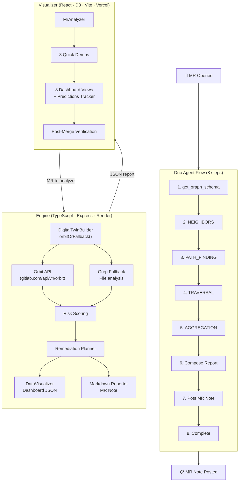

# Orbit Sentinel — Autonomous Engineering Digital Twin

> AI predicts code. Orbit Sentinel predicts **consequences**.

[](https://gitlab.com/gitlab-ai-hackathon/transcend/39251857/-/pipelines)
[](https://orbit-sentinel.vercel.app)
[](https://gitlab-transcend.devpost.com)
[](https://orbit-sentinel.vercel.app/?judge=true)

**Orbit Sentinel** is an autonomous engineering digital twin powered by GitLab Orbit. Paste any GitLab MR URL to build a living model of the affected system — discovering blast radius, historical incidents, ownership, deployment dependencies, and rollback strategies across **8 interactive dashboard views**. When Orbit is unavailable, the engine degrades gracefully using file-analysis fallback. A published Duo Agent Platform flow enables fully autonomous MR posting.

---

## Judge's Quick Links

| Document | What It Shows |
|----------|---------------|
| [Live Demo](https://orbit-sentinel.vercel.app) | Interactive 8-view dashboard — loads instantly, upgrades to live data when engine responds |
| [Judge's Tour](https://orbit-sentinel.vercel.app/?judge=true) | Guided walkthrough — Space for auto-demo, ← → to navigate |
| [Devpost Submission](orbit-sentinel/demo/devpost-submission.md) | Full entry: inspiration, architecture, quantified impact |
| [Demo Script](orbit-sentinel/demo/demo-script.md) | 3-minute walkthrough to follow with the live site |
| [Sample MR Note](orbit-sentinel/demo/output/sample-impact-report.md) | What the agent posts on a merge request |
| [Orbit Traversal Proof](orbit-sentinel/docs/orbit-traversal-results.md) | Raw results from live Orbit queries |
| [Flow YAML](orbit-sentinel/flow/orbit-sentinel-flow.yaml) | 8-step Duo Agent Platform workflow (published to AI Catalog) |
| [Changelog](orbit-sentinel/CHANGELOG.md) | Full feature and fix history |

---

## What Makes This Different

| Differentiator | Orbit Sentinel | Traditional CI/CD |
|----------------|---------------|------------------|
| **Visual analysis** | 41 components, 8 views, 3 breakpoints, interactive D3 graphs | Text-only output |
| **Closed-loop accuracy** | Tracks predictions post-merge with 7-day survival window, computes accuracy score | Predicts but never verifies |
| **4 Orbit query types** | NEIGHBORS + PATH_FINDING + TRAVERSAL + AGGREGATION cross-referenced | Single-query or no graph data |
| **Fallback resilience** | Grep-based file analysis when Orbit is down — still delivers analysis | Fails on Orbit downtime |
| **Test coverage** | **124 tests** (95 engine + 29 visualizer) — zero `as any` in production code | Minimal or no test suite |
| **Deployment** | Vercel + Render, Docker Compose, CI/CD (6 jobs, 4 stages) | Manual setup |
| **Onboarding** | Judge's Tour, auto-demo, setup wizard, keyboard shortcuts | No UX |

---

## MR Analysis — Core Capability

### Paste Any GitLab MR URL

The **MR Analyzer** panel accepts any GitLab merge request URL — parses the project path and MR ID, fetches changed files via the engine's CORS proxy, then runs all 4 Orbit query types against the affected files.

**Live analysis flow:**
1. Paste MR URL → auto-extracts project + MR IID
2. Engine fetches changed files from GitLab API (up to 5 files, CORS-free)
3. `DigitalTwinBuilder` executes NEIGHBORS + PATH_FINDING + TRAVERSAL + AGGREGATION
4. Results merged into unified graph → 8 dashboard views populate
5. Post-merge: every prediction tracked against real outcome in Predictions Tracker

**No token required** for basic analysis. Optional GitLab PAT (`glpat-xxx`, `read_api` scope) enables richer file content — sent once, discarded after.

### 3 Pre-Configured Quick Demos

| Scenario | What It Shows | Risk |
|----------|---------------|------|
| 🔴 **Critical Risk** | Pipeline failed, 7 downstream services at risk, no rollback plan | 88% |
| 🟡 **Medium Risk** | Empty diff, no pipeline, abandoned branch pattern | 55% |
| 🟢 **Low Risk** | All tests pass, reviewers approved, no downstream impact | 15% |

Each populates all 8 views with realistic interconnected data.

---

## The Closed Loop: Predict → Verify → Improve

Orbit Sentinel doesn't just predict — it **proves its predictions were right**.

| View | What It Shows |
|------|---------------|
| **Predictions Tracker** 🎯 | Scoreboard of all past predictions vs actual outcomes. Animated stat counters, risk trend chart (DualSparkline), accuracy rate, true/false positives |
| **Post-merge verification** | Enter "failed" or "shipped" for any tracked MR. Accuracy score updates in real-time. 7-day survival window for high-risk predictions |
| **Filterable ledger** | Sort by date, risk level, or outcome. Filter by pending / verified / failed |

---

## Fallback Resilience

When Orbit's API is unavailable, Orbit Sentinel **degrades gracefully**:

1. Each of 9 Orbit query calls is wrapped in `orbitOrFallback()` — `try` Orbit first, `catch` on network/auth errors
2. On failure, falls back to **grep-based file analysis** via GitLab Repository Files API
3. Changed files are fetched, dependencies parsed (`import`/`require` in JS/TS, `import`/`from` in Python)
4. Analysis completes with `fallback: true` flagged in the response
5. Visualizer shows a **"Degraded" mode** banner — orange dot, orange border, "Orbit unavailable — using file analysis fallback"
6. Empty Orbit results (normal for new projects with no pipeline history) no longer trigger the fallback flag — the app stays "Live"

**Fast path:** No GitLab token → return empty immediately instead of hanging on timeouts.

---

## Architecture

### Component Patterns
- **Atomic Design**: 41 components organized in a hierarchical pattern — atoms (basic UI elements), molecules (combinations of atoms), organisms (self-contained sections), templates (page layouts), and pages (complete view compositions)
- **State Management**: Custom hooks (`useAnimatedValue`, `useMediaQuery`, `useVulnerabilities`) + React Context API + URL state via `useState`/`useEffect` for global application state
- **Data Flow**: Client-server pattern with `ApiService` class handling Orbit API calls, `DigitalTwinBuilder` orchestrating query execution, and `DataVisualizer` transforming results into dashboard JSON

### API Integration
- **GitLab Auth**: Simple GitLab Personal Access Token (`glpat-xxx`) with `read_api` scope for file content access
- **Rate Limiting**: 500ms throttle between file iterations, max 5 files per MR, exponential backoff for transient errors
- **Error Classification**: 8 error types (`RATE_LIMIT`, `AUTHENTICATION_ERROR`, `QUOTA_EXCEEDED`, `ORBIT_API_ERROR`, `NETWORK_ERROR`, `SERVICE_UNAVAILABLE`, `VALIDATION_ERROR`, `INVALID_MR`) with specific recovery strategies

### Performance Optimizations
- **Bundle Size**: ~125KB gzipped with lazy-loading of critical components via Vite's code splitting
- **Rendering**: React 18 concurrent rendering with `Suspense` boundaries, `React.memo` and `useMemo` optimizations
- **Caching**: 5-minute API response caching, `localStorage` for user preferences and theme persistence



Every conclusion cites specific Orbit query evidence. No black box.

---

## Quick Start

```powershell
.\orbit-sentinel\setup.ps1        # One command — install, build, start → http://localhost:5173
```

**Live demo**: [orbit-sentinel.vercel.app](https://orbit-sentinel.vercel.app) — interactive dashboard, auto-play, post-merge verification.

**Docker**:
```bash
docker compose up   # Engine (3001) + visualizer (80 via nginx) with health checks
```

---

## Dashboard Views

| View | What It Shows | Orbit Query |
|------|---------------|-------------|
| **Overview** | Impact Calculator (interactive ROI sliders), hero prediction, evidence panel, decision center, counterfactual simulation, digital twin graph, Orbit Query Inspector | All 4 |
| **Setup** | 4-step guided journey — Mission → Architecture → Setup → Launch | — |
| **Blast Radius** | Interactive dependency explorer with depth control — click nodes to inspect. Security Findings stat pill with critical/high vulnerability counts. Per-file vulnerability badges with severity coloring | NEIGHBORS |
| **Risk** | 5-dimension risk breakdown with probability bars — click mitigations to see risk animate down. Pipeline Failure Correlation card with correlation coefficient bar, failure probability heatmap, historical reliability insight | AGGREGATION |
| **Forecast** | Counterfactual analysis with timeline — toggle variables, watch risk animate in real-time. Failure rate, pipeline evidence, deployment path, prediction confidence | Simulation |
| **History** | Repository memory with Jaccard similarity scoring — has this failed before? | TRAVERSAL |
| **Report** | Full formatted MR comment output — ready to copy. Export dropdown: copy Markdown to clipboard or download as JSON | All 4 |
| **Predictions Tracker** 🎯 | Accuracy scoreboard, post-merge verification, risk trend chart, vulnerability-adjusted predictions table with per-file severity breakdown and confirmation toggles | Closed-loop |

---

## Details

**Engine** — Express server at `orbit-sentinel/engine/` deployed on **Render** (TypeScript, **95 tests**):
- `DigitalTwinBuilder` — orchestrates 9 Orbit queries across all 4 query types via `orbitOrFallback()` wrappers, merges results into unified graph
- `Grep Fallback` — fetches files via GitLab Repository Files API, parses imports, builds dependency graph without Orbit
- `Risk Engine` — 5-factor scoring from Orbit evidence (predictions, blast radius, incidents, pipeline health, reviewer coverage)
- `Memory Store` — Jaccard similarity engine for historical incident matching
- Rate-limited: max 5 files per MR, 500ms throttle between iterations (23 queries per analysis, down from 107)
- Debug endpoint: `/api/debug-orbit` for live Orbit connectivity testing

**Visualizer** — React app at `orbit-sentinel/visualizer/` deployed on **Vercel** (TypeScript, **29 tests**):
- 41 components, zero CSS files — design token system (colors, z-index tiers, animation presets, spacing scale)
- 3 responsive breakpoints (360px–768px+), touch-friendly
- Judge's Tour (`?judge=true`) — guided walkthrough, Space for auto-demo, ← → / 1-8 to navigate
- Keyboard shortcuts: **1–8** switch views, **D** toggle demo, **E** toggle editor
- Theme toggle (light/dark) persisted to localStorage
- DataModeBanner: 6 modes — loading / connecting / live / demo / error / degraded
- OrbitQueryInspector: expandable raw GraphQL results from all 4 query types

**Duo Agent Platform Integration**:
- Flow YAML (`flow/orbit-sentinel-flow.yaml`) — 8 steps, published to AI Catalog with successful run
- Skill definition (`.gitlab/duo/skill.yml`) — category: code_review, 3 capabilities
- MCP config (`.gitlab/duo/mcp.json`) — HTTP connection to Orbit knowledge graph
- 6 query recipes (`skills/orbit-sentinel/recipes/`) — ready-to-use JSON for each query pattern

**Testing** — **124 tests total** (95 engine + 29 visualizer), zero `as any` in production code. Engine covers Orbit client error handling, all 4 query types, similarity engine edge cases, risk thresholds, twin construction, rollback strategies. Visualizer covers DataModeBanner, PredictionsTracker, OrbitQueryInspector, DigitalTwinGraph, and all major views.

**Stack** — Node 22+, TypeScript 5.5, React 18, D3.js, Vite 5.3, Express, Vitest.

| Status | |
|--------|---|
| Deployed | Visualizer on [Vercel](https://orbit-sentinel.vercel.app), engine on [Render](https://orbit-sentinel.onrender.com) |
| Tests | **124 passing** (95 engine + 29 visualizer) |
| Live Orbit Data | Engine returns real graph data for project ID **39251857** (222+ nodes, 187+ edges from live Orbit) |
| Quick Demos | 3 pre-configured risk scenarios (Critical 🔴, Medium 🟡, Low 🟢) |
| Fallback | Grep-based file analysis when Orbit unreachable — degraded mode banner in UI |
| Closed Loop | Predictions tracked post-merge with accuracy scoring, survival window, verification input |
| Docker | `docker compose up` boots full stack with health checks |
| Flow Published | 8-step Duo Agent Platform workflow in AI Catalog (1+ successful run) |

---

## UX Highlights

| Feature | Details |
|---------|---------|
| **Instant load** | Demo data shown immediately on page open — engine data swapped in background when ready |
| **Gradient glow card** | Purple gradient background, `0 0 30px` neon glow shadow, corner radial decoration, grid dot pattern |
| **Pulsing live badge** | Green dot with `pulseDot` animation + "Engine Live" label when engine is reachable |
| **Degraded mode banner** | Orange dot + border when Orbit is down and fallback is active |
| **Success toast** | Green banner "✓ Analysis complete — MR !X" fades in for 5s |
| **MR validation** | Input shows format indicator when URL matches `gitlab.com/<project>/-/merge_requests/<digits>` |
| **Glassmorphism** | `backdrop-filter: blur(6px)` on cards, architecture nodes, flow progress |
| **Keyboard shortcuts** | **1–8** switch views, **D** toggle demo, **E** toggle editor — tooltip overlay at screen bottom |
| **Theme toggle** | 🌙/☀️ in top nav — persists in localStorage, all components adapt via CSS variables |
| **Mobile** | 3 breakpoints to 360px, touch scrolling, dropdown nav on tiny screens |

---

## Built For

[GitLab Transcend Hackathon](https://gitlab-transcend.devpost.com/) — Showcase Track · MIT License
