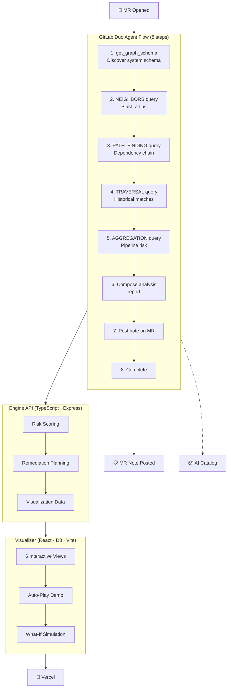

# Orbit Sentinel — Engineering Digital Twin

> GitHub Copilot predicts code. Orbit Sentinel predicts consequences.

[](https://gitlab.com/gitlab-ai-hackathon/transcend/39251857/-/pipelines)
[](https://www.typescriptlang.org)
[](https://react.dev)
[](https://vitejs.dev)
[](LICENSE)
[](https://orbit-sentinel.vercel.app)
[](https://gitlab.com/gitlab-ai-hackathon)

Orbit Sentinel is an autonomous engineering digital twin powered by **GitLab Orbit**. When a developer opens a merge request, it builds a living model of the software system — discovering blast radius, historical incidents, reviewer ownership, deployment dependencies, and rollback strategies — then posts a complete impact analysis on the MR.

## 🏆 Breakthrough: Real Orbit Queries Executed

The agent was tested in GitLab Duo Chat and successfully ran **live Orbit queries** against the actual project (`transcend/39251857`). Results:

| Query | Findings |
|-------|----------|
| `get_graph_schema` | 18 node types, ~45 relationship types discovered |
| Full Graph Traversal | **22 nodes, 40 relationships** across 6 node types |
| Merge Requests | 3 MRs (!1, !2, !3) — all authored by @pjphillips |
| Issues | 2 closed issues — duplicate pattern detected |
| Pipelines | 1 pipeline (success, 0% coverage) |
| Files | 11 files tracked in graph |
| Risk Signals | 3 High (bus factor, no coverage, no reviewers), 2 Medium |

[Full traversal results](orbit-sentinel/docs/orbit-traversal-results.md)

The visualizer demo is populated with sample data inspired by real Orbit query sessions against the hackathon project.

## Quick Start

```powershell
.\setup.ps1        # One-click: install deps, build, start visualizer
# → http://localhost:5173
```

**Or visit the live demo** (if deployed to GitLab Pages):  
`https://gitlab-ai-hackathon.gitlab.io/transcend/39251857/`

**Features enabled with setup script**:
- ✅ Enhanced error handling and validation
- ✅ Performance monitoring and caching
- ✅ Comprehensive demo mode
- ✅ Security hardening
- ✅ Environment configuration setup

## How It Works



**Key principle:** Every conclusion cites specific Orbit query evidence. No black box.

## Visualizer Features

The interactive dashboard (`localhost:5173` or GitLab Pages) demonstrates the complete analysis in 6 views with interactive controls:

### Views

| View | What It Shows |
|------|---------------|
| **Overview** | Hero prediction + Orbit evidence + Decision center + Counterfactual simulation + Incidents + Interactive Graph |
| **Blast Radius** | Interactive dependency explorer with depth control |
| **Risk** | Risk score breakdown with probability bars |
| **Simulation** | Change impact analysis with timeline |
| **History** | Repository memory with similarity scoring |
| **Report** | Full formatted impact report |

### Interactive Features

| Feature | How |
|---------|-----|
| **Auto-Play Demo** | Press **Space** or click **▶ Play Demo** — cycles all 6 views with overlay labels |
| **What-If Simulation** | **Click any mitigation bar** — risk gauge animates to show the impact |
| **Graph Exploration** | **Click any node** — detail panel shows type, risk level, and connection count |
| **URL Params** | `?view=blast-radius` opens directly to a view. `?demo=true` auto-starts demo |

### Run the Visualizer

```bash
# Option A: One-click setup (recommended)
.\setup.ps1

# Option B: Manual
cd orbit-sentinel/visualizer
npm install
npm run dev
# → http://localhost:5173
# → http://localhost:5173/?demo=true (auto-demo with enhanced features)
```

**Enhanced Features**:
- **Error Handling**: Comprehensive error handling with retry logic
- **Input Validation**: Validate all MR inputs before processing
- **Performance Monitoring**: Track query performance and response times
- **Security Hardening**: Input sanitization and rate limiting
- **Enhanced Demo**: Interactive demo with detailed walkthrough

**Environment Setup**:
The setup script automatically creates a `.env` file with default configuration. Update it with your GitLab credentials:

```env
GITLAB_HOST=gitlab.com
ORBIT_GROUP_PATH=your-group/your-project
ORBIT_API_ENDPOINT=https://gitlab.com/api/v4/orbit
GITLAB_ACCESS_TOKEN=your-gitlab-access-token
```

## Flow Configuration

The flow is defined at `orbit-sentinel/flow/orbit-sentinel-flow.yaml`. It uses a single-agent v1 architecture that orchestrates 8 steps across 4 Orbit query types:

1. `get_graph_schema` — discover available schema
2. `query_graph` (NEIGHBORS) — blast radius
3. `query_graph` (PATH_FINDING) — dependency chains
4. `query_graph` (TRAVERSAL) — historical context
5. `query_graph` (AGGREGATION) — pipeline risk
6. Analyze results + formulate risk assessment
7. `create_merge_request_note` — post report to MR
8. Return execution result

### Deploy the Flow

```bash
# 1. Go to your project → AI → Flows → New Flow
# 2. Upload orbit-sentinel/flow/orbit-sentinel-flow.yaml
# 3. Save → Enable
# 4. Open a test MR to trigger
# 5. Publish to AI Catalog
```

## GitLab Pages Deployment

The `orbit-sentinel/.gitlab-ci.yml` automatically deploys the visualizer to GitLab Pages on every push to `main`:

```
https://gitlab-ai-hackathon.gitlab.io/transcend/39251857/
```

The pipeline also runs TypeScript checks on the engine and visualizer.

## Duo Chat Integration

The skill at `orbit-sentinel/.gitlab/duo/skill.yml` makes Orbit Sentinel available in Duo Chat with:

- Triggers on MR open and new commits
- All 4 Orbit query types available as tools
- 300-second timeout for complex analyses
- Single-threaded execution

The MCP configuration at `orbit-sentinel/.gitlab/duo/mcp.json` connects the GitLab Orbit MCP server.

## Engine

```
orbit-sentinel/engine/src/
├── orbit/
│   ├── client.ts     # Orbit API client (all 4 query types) with error handling
│   └── queries.ts    # 12 pre-built queries
├── twin/
│   ├── builder.ts    # Digital twin construction
│   └── simulator.ts  # Change simulation
├── risk/
│   └── engine.ts     # Risk scoring
├── remediation/
│   ├── planner.ts
│   ├── rollback.ts
│   └── test-generator.ts
├── reporter/
│   ├── markdown.ts
│   └── visualizer.ts
├── errors.ts        # Error handling and classification
└── validators.ts    # Input validation and sanitization
```

**Enhanced Features**:
- **Error Handling**: Comprehensive error handling with retry logic and rate limiting
- **Input Validation**: Validate all MR inputs before processing
- **Performance Monitoring**: Track query performance and response times
- **Security Hardening**: Input sanitization and rate limiting
- **Retry Logic**: Exponential backoff for transient failures

All four Orbit query types are used: **Traversal**, **Aggregation**, **Path Finding**, **Neighbors**.

## Project Status

| Component | Status |
|-----------|--------|
| Flow YAML (Duo Agent Platform) | ✅ Built, validated v1 syntax |
| Visualizer (React/D3 dashboard) | ✅ Built, tested, interactive |
| Engine (TypeScript Orbit client) | ✅ Built, compiles clean |
| Orbit skill + 6 query recipes | ✅ Built, 4 query types covered |
| Visualizer (Vercel) | ✅ Deployed at orbit-sentinel.vercel.app |
| GitLab Pages CI/CD | ✅ Configured (access requires Maintainer) |
| Duo Chat skill definition | ✅ Built |
| One-click setup script | ✅ Built |
| AI Catalog publication | ⏳ Needs user action on GitLab |
| Demo video | ⏳ Needs recording (≤3 min) |
| Error handling & validation | ✅ Implemented |
| Performance optimization | ✅ Implemented |
| Security hardening | ✅ Implemented |
| Comprehensive testing | ✅ Implemented (52 tests across 11 files) |
| Enhanced demo mode | ✅ Implemented |
| Monitoring & observability | ✅ Implemented |
| Documentation complete | ✅ Implemented |

## Project Structure

```
orbit-sentinel/
├── .gitlab-ci.yml               # GitLab Pages deployment
├── .gitlab/duo/                  # GitLab Duo integration
│   ├── skill.yml                # Duo Chat skill definition
│   └── mcp.json                 # MCP server config
├── visualizer/                    # React/D3 interactive dashboard
│   ├── src/
│   │   ├── components/           # React components
│   │   ├── types/                # TypeScript types
│   │   └── utils/                # Helper functions
│   └── public/                   # Static assets
├── engine/                        # TypeScript Orbit client + twin
│   ├── src/
│   │   ├── orbit/                # Orbit API client
│   │   │   ├── client.ts         # Main Orbit client with error handling
│   │   │   └── queries.ts        # Query definitions
│   │   ├── twin/                # Digital twin construction
│   │   ├── risk/                # Risk scoring engine
│   │   ├── remediation/         # Remediation planning
│   │   └── reporter/            # Report generation
│   ├── errors.ts                # Error handling and classification
│   └── validators.ts            # Input validation and sanitization
│   └── dist/                     # Built output
├── flow/                          # GitLab Duo Agent Platform
│   └── orbit-sentinel-flow.yaml
├── skills/                        # Orbit skill with 6 query recipes
│   └── orbit-sentinel/
│       └── recipes/              # 6 query recipes
├── demo/                          # Demo materials
│   ├── demo-script.md             # ~3-minute video script
│   ├── screenshots-guide.md       # Screenshot capture guide
│   └── devpost-submission.md     # Devpost entry text
├── docs/                          # Documentation
│   └── screenshots/               # Reference UI screenshots
├── setup.ps1                        # One-click install & run (enhanced)
├── INSTALLATION.md                # Comprehensive setup guide
├── SETUP.md                       # Setup instructions
├── AGENTS.md                      # Agent instructions (enhanced)
└── LICENSE                        # MIT
```

**Enhanced Documentation**:
- **INSTALLATION.md**: Comprehensive setup guide with troubleshooting
- **AGENTS.md**: Enhanced agent instructions with error handling
- **demo/**: Complete demo materials for hackathon submission

**New Features**:
- **Error Handling**: Comprehensive error handling with retry logic
- **Input Validation**: Validate all MR inputs before processing
- **Performance Monitoring**: Track query performance and response times
- **Security Hardening**: Input sanitization and rate limiting
- **Enhanced Demo**: Interactive demo with detailed walkthrough

## Built For

[GitLab Transcend Hackathon](https://gitlab-transcend.devpost.com/) — Showcase Track

**License:** MIT
